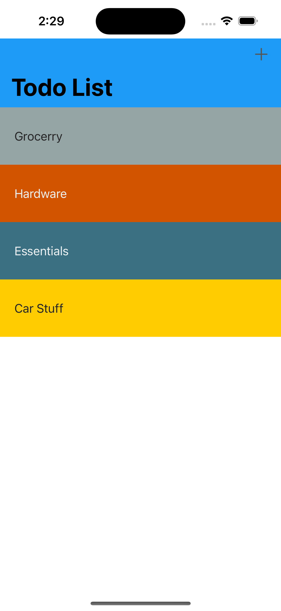
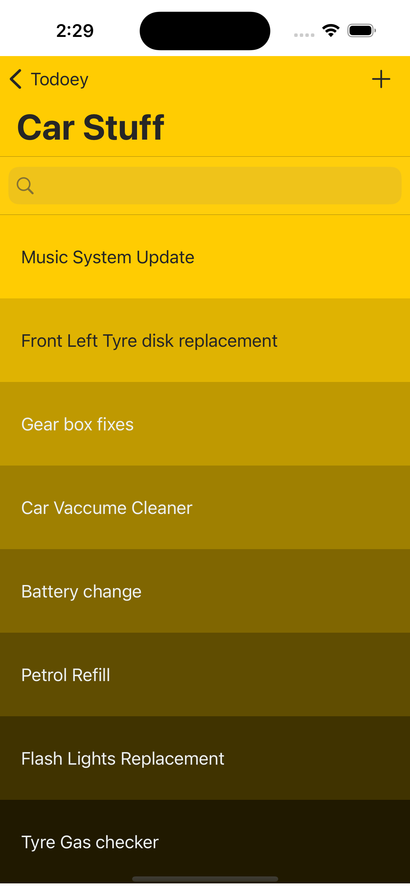

# Todoey ✓

A simple To-Do List application for iOS built with Swift and using the Realm database.

## Features
- Create and manage your tasks with ease.
- Mark tasks as complete or incomplete.
- Persistent storage of tasks using Realm database.
- Easily delete tasks you no longer need.

## Requirements
- iOS 13.0+
- Xcode 12.0+
- Swift 5.0+

## Screenshots

Main             |        Tasks  
:-------------------------:|:-------------------------:
  |   

## License
This project is licensed under the MIT License - see the LICENSE file for details.

## Acknowledgments
Realm - The local database used in this project.
